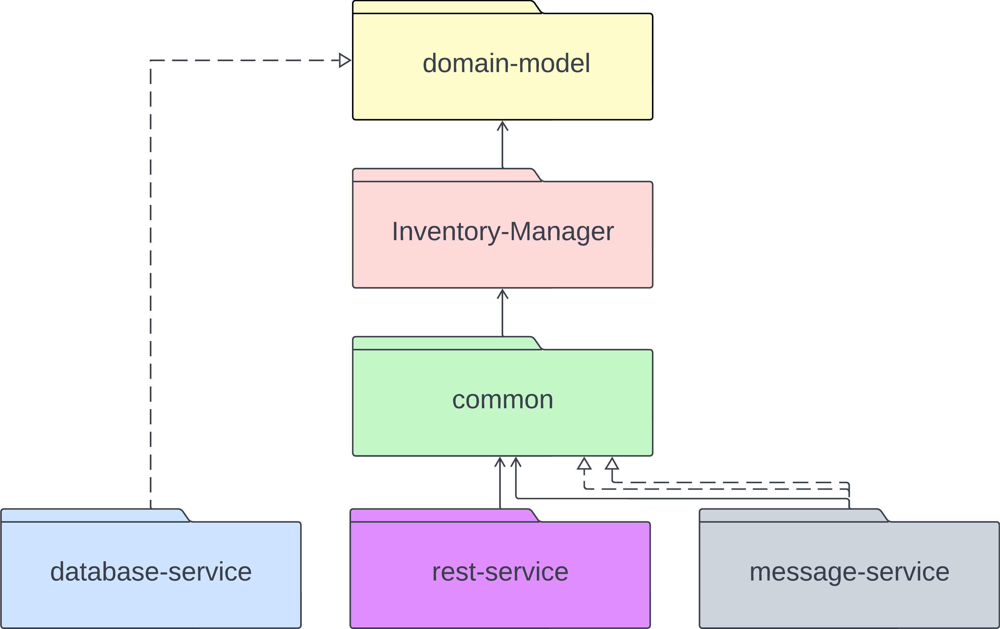

# Inventory-Management

The Inventory-Management is a microservice developed for the Production-Management-System. 

It manages the Inventory and is used to persists data. The Inventory contains the Resource-Sets created and used by other microservices within the Production-Management-System.

The Inventory-Management provides Jakarta-Endpoints (REST) and Kafka-Endpoints (Event-Steaming).

## Table of Contents

- [Architecture](#architecture)
- [Rest-Endpoint](#rest-endpoint)
   - [Get Resource-Set](#get-resource-set)
   - [Add Resource-Set](#add-resource-set)
   - [Delete Resource-Set](#delete-resource-set)
- [Kafka-Endpoint](#kafka-endpoint)
   - [decreaseResourceSetRequest](#topic-decreaseresourcesetrequest)
   - [decreaseResourceSetResponse](#topic-decreaseresourcesetresponse)
   - [Error](#topic-error)
- [Deployment](#deployment)
   - [Deploy as standalone](#deploy-as-standalone)
   - [Deploy with Production-Management-System](#deploy-with-production-management-system)
- [Environment Variables](#environment-variables)
   - [MySQL Configuration](#mysql-configuration)
   - [Kafka Broker Configuration](#kafka-broker-configuration)
- [License](#license)
- [Authors](#authors)


## Architecture

The Inventory-Management microservice was developed following the principles of Clean Architecture design and follows a modular [architecture](./presentation/Praktikum-Microservices-InventoryManagment.png) to ensure scalability, maintainability, and reliability. It consists of the following key modules:

- **domain-model**: 
   - Provides core concepts and entities of the microservice.     Examples are `Resource-Set` and `Resource-Set-Repository`.
   
- **inventory-manager**:
   - Contains use-cases and manages the `Resource-Set-Repository`.

- **common**:
   - Controlls the communication between the rest-service,     message-service and the inventory-manager.

- **database-service**:
   - Utilizes MySQL as the primary database management system for storing and managing inventory data.

- **rest-service**:
   - Provides HTTP endpoints for CRUD operations on the inventory.

- **message-service**:
   - Facilitates asynchronous communication with other microservices through Kafka topics for real-time data processing.


## Rest-Endpoint

### Get Resource-Set
- **URL**: `/resource/set/{id}`
- **Method**: `GET`
- **Description**: Retrieves a `Resource-Set` by its `id`.
- **Request**: 
  - Path Parameter:
    - `id` (integer): ID of the `Resource-Set` to retrieve.
- **Response**: 
  - Content Type: `application/json`
  - Body: `Resource-Sets`

### Add Resource-Set
- **URL**: `/resource/set`
- **Method**: `POST`
- **Description**: If the `Resource-Set` already exists, adds the `Resource` amount to the existing `Resource-Set`, else creates a new `ResourceSet`
- **Request**: 
  - Body: JSON object representing the `Resource-Set` to be added.
- **Response**: 
  - Content Type: `application/json`
  - Body: The added `Resource-Set` 

### Delete Resource-Set
- **URL**: `/resource/set/{id}`
- **Method**: `DELETE`
- **Description**: Deletes a `Resource-Set` by its `id`
- **Request**: 
  - Path Parameter:
    - `id` (integer): ID of the `Resource-Set` to delete

## Kafka-Endpoint
### Topic: decreaseResourceSetRequest
- **Role**: `Consumer`
- **Key**: `Long` -type identifier used to map requests to their corresponding responses.
- **Value**: `Resource-Set`
- **Description**: Decreases the amount of `Resources` from an existing `Resource-Set`

### Topic: decreaseResourceSetResponse
- **Role**: `Producer`
- **Key**: `Long` -type identifier used to map requests to their corresponding responses.
- **Value**: `Boolean` indicating the success status of the request.
- **Description**: Response to a decreaseResourceSetRequest.

### Topic: Error
- **Role**: `Producer`
- **Key**: `null`
- **Value**: `Inventory-Management-Error`, specifing the error reason.
- **Description**: Error logging with Kafka, can be used by other microservices to detect problems


## Deployment

This project is fully deployable with docker. There are two options available, deploy as standalone and deploy with the entire Production-Management-System.

### Deploy as standalone
This option only deploys the Inventory-Management and its mysql-database.

Navigate to this [folder](./) within powershell or similiar and run:

```powershell
  docker-compose up
```

This will download all dependencies, build and deploy the microservice, and also download the mysql database and deploy it within a multi container setup.

The Kafka-Server and the other microservices can be independently deployed. If you do that, add them to the [Environment Variables](#environment-variables). If you want to set up Kafka locally, [here](../kafka-informations/SetupKafkaLocally.txt") are helpfully informations and scripts.

### Deploy with Production-Management-System
This option deploys the Inventory-Management together with the Production-Management-System and is configuration free.

Navigate to this [folder](../) within powershell or similiar and run:
```powershell
  docker-compose up
```
This will download, build and deploy the Inventory-Database, the Maschine-Database, the Kafka-Server, the Order-Management, the Maschine-Managment and the Inventory-Management  within a multi container setup. No further configurations are necessary.


## Environment Variables
The environment variables are configured in the docker-compose files. Depending on the chosen deployment option, no changes to the default values are necessary.
### MySQL Configuration:

- **DB_HOST**:
  - Description: Specifies the hostname of the MySQL database.
  - Value: `<DB_HOST>`

- **DB_PORT**:
  - Description: Specifies the port number of the MySQL database.
  - Value: `<DB_PORT>`

- **DB_USERNAME**:
  - Description: Specifies the username for accessing the MySQL database.
  - Value: `<DB_USERNAME>`

- **DB_PASSWORD**:
  - Description: Specifies the password for the MySQL user.
  - Value: `<DB_PASSWORD>`

### Kafka Broker Configuration:

- **KAFKA_BROKER_HOST**:
  - Description: Specifies the hostname of the Kafka broker.
  - Value: `<KAFKA_BROKER_HOST>`

- **KAFKA_BROKER_PORT**:
  - Description: Specifies the port number of the Kafka broker.
  - Value: `<KAFKA_BROKER_PORT>


## License

This project is licensed under the MIT License - see the [LICENSE](./LICENSE.txt) file for details.

## Authors

- [@Tobin Zühlke](https://github.com/Tobin123456)
